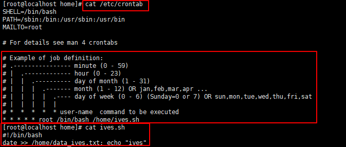

# Crontab

crontab用於設置周期性被執行的指令。

# 查看該用戶的crontab

```bash
cat /etc/crontab
```

- 

# 建立一個工作

編輯一個工作，每分鐘輸出目前的時間到data1.txt

```bash
crontab -e
```

查看時程內容

```bash
crontab -l
```

填入內容

```bash
* * * * * date >> /home/data1.txt;
```

查看運行結果

```bash
tail -f data1.txt
```


# 增加新的內容


```bash
crontab -e
```

```bash

* * * * * date >> /home/data1.txt; ls /usr/local/ >> /home/data1.txt
```

查看時程內容

```bash
crontab -l
```


運行結果


# 直接編輯/etc/crontab運行sh腳本


ives.sh

```bash
#!/bin/bash
date >> /home/data_ives.txt; echo "ives"
```

編輯/etc/crontab

```bash
vi /etc/crontab
```

填寫內容

```bash
* * * * * root /bin/bash /home/ives.sh
```



查看結果

```bash
tail -f data_ives.txt
```


# 常用指令

重啟服務

```bash
service crond restart
```

開始服務

```bash
service crond start
```

停止服務

```bash
service crond stop
```

# 查看cron日誌

```bash
tail -f /var/log/cron
```


# 參考網站

http://c.biancheng.net/view/1092.html

https://blog.gtwang.org/linux/linux-crontab-cron-job-tutorial-and-examples/